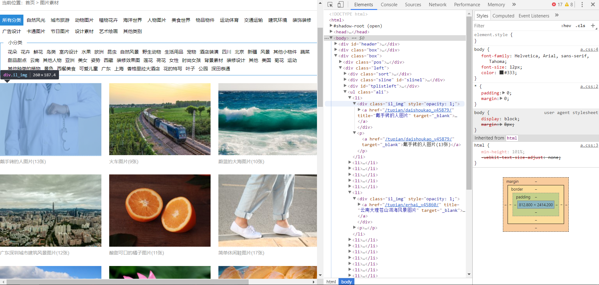
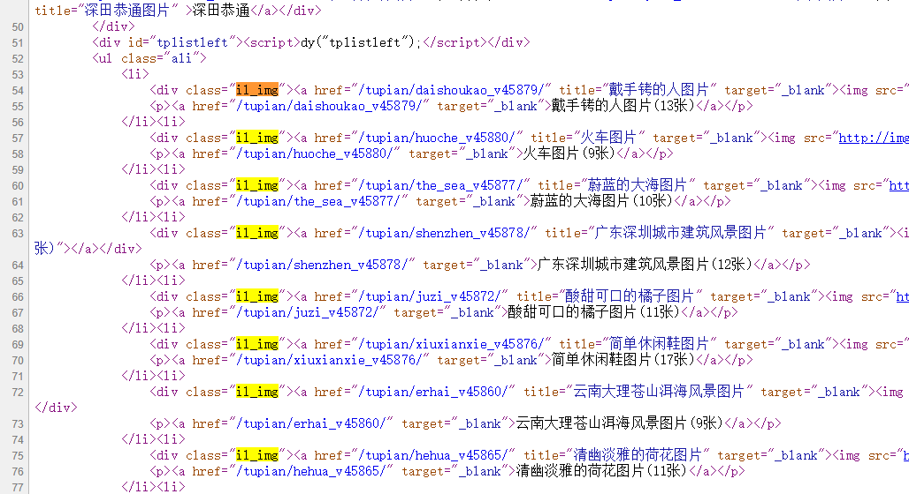
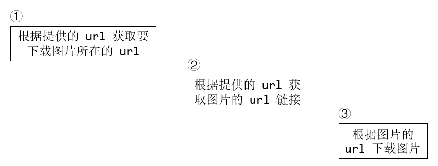

# 爬虫编写过程

tag: abc, def

---

## 查看网页

准备制作爬虫

1. 打开网页，找到要爬取的链接，在本示例中，爬取的链接为一组图片
    
    

1. 查看网页源代码，看是否能找到该链接，若找得到，则为静态网页
    
    

    * 现在知道，我们要爬取的链接格式为
      ```html
      <div class="il_img">
          <a href="目标链接" title="标题" ...>
          ...
      </div>
      ```

1. 打开一组图片，以如上方式查看图片链接格式

    * 得到格式同上，但不同的是需要获取的是 `` 标签内容
      ```html
      <div class="il_img">
          <a href="单张图片" ...>
          ...
          
          ...
      </div>
      ```
    
    * 注意，此处的图片为缩略图，若想要下载原图片，需要按照 `href` 给出的链接再往更深处爬取一层。因本文档的目的在于展示如何编写爬虫，所以只获取了缩略图

1. 还需要得到下一页的链接，找到最初的网页，同上

    * 得到格式
      ```html
      <div class="pagelist">
          ...
          <a class="page-next" href="下一页链接">下一页</a>
      </div>
      ```

## 编写代码

### 单线程代码

#### 爬取网页内容的函数

1. 获取图片组的函数

    ```python
    def _get_picture_group(self, url):
        response = requests.get(url)
        soup = BeautifulSoup(response.text, 'html.parser')

        tags = soup.find_all('div', attrs={'class': 'il_img'})
        targets = [(tag.a['title'], tag.a['href']) for tag in tags]
        
        return targets
    ```

1. 获取下一个链接的函数

    ```python
    def _get_next_url(self, url):
        response = requests.get(url)
        soup = BeautifulSoup(response.text, 'html.parser')

        tags = soup.find_all('a', attrs={'class': 'page-next'})
        
        if not tags:
            return None
        
        return tags[0]['href']
    ```

1. 获取图片链接的函数

    ```python
    def _get_picture_urls(self, url):
        response = requests.get(url)
        soup = BeautifulSoup(response.text, 'html.parser')

        tags = soup.find_all('div', attrs={'class': 'il_img'})
        targets = [tag.img['src'] for tag in tags]

        return targets
    ```

可以发现，上面的函数有不少重复代码，可以抽取出来写成一个单独的工具函数，如：

```python
def _get_soup(self, url):
    text = requests.get(url)
    soup = BeautifulSoup(text)
```

另外，我还没有添加异常处理的部分，可以添加在上面的 `_get_soup` 函数中

#### 下载图片

```python
def _download_pictures(self, img_urls, dest_dir):
    count = 1
    for img_url in img_urls:
        req = request.Request(img_url)
        try:
            get_img = request.urlopen(req).read()
        except urllib.error.HTTPError as err:
            print('download error', img_url, err)
            continue
    
        with open(os.path.join(dest_dir, str(count) + '.jpg'), 'wb') as fp:
            fp.write(get_img)
        
        count += 1
```

将下载图片到 `dest_dir`，我爬取了3个网页，花费总时间为 `245.15` 秒，网速为 `0.1Mbps` 左右

实验代码在 [完整代码](./codes/first_code.py)

### 协程代码

首先观察我们需要进行的步骤：



可以看到我们需要按照 `1 -> 2 -> 3` 这种顺序进行网页爬取，而后面两个步骤都涉及到多个 `url`，因此很适合使用协程

在示例代码中，我只在第3个步骤使用了协程进行并发，实际上第2个步骤也可以使用

[示例代码](./codes/second_code.py)

使用示例代码爬取3个网页，花费总时间为 `84.05` 秒，总时间为之前的 `1/3` 左右